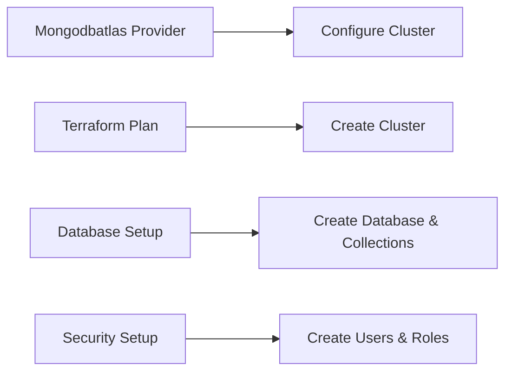

# SnackHub.Database.Terraform

This repository holds the Terraform configuration to deploy a M0(Free Tier) [MongoDB](https://www.mongodb.com/) cluster on [MongoDB Atlas](https://www.mongodb.com/atlas). <br>

Basically this repository is used to provide database infrastructure as code that will be consumed by [SnackHub](https://github.com/Team-One-Pos-Tech/SnackHub) project when deployed at AWS or any other cloud provider.

This project is intended to be executed by an automated CI project, however it can be used by a developer or any techincal person at its local environment, this second one need to have some setup first. It will be described later at this documentation.


## How it Works

The Terraform code in this repository uses the `mongodbatlas` provider to interact with MongoDB Atlas. The code provisions a new cluster, creates databases, and sets up user access controls.

Here's a high-level overview of the deployment process:



## How to use it

### Local Execution

To make it possible to execute the code at this repository, please, make sure you:
    - Have install Terraform ([version 1.9.6](https://github.com/hashicorp/terraform/releases/tag/v1.9.6) or [later](https://github.com/hashicorp/terraform/releases)) on your machine.
	- Have a [MongoDB Atlas Account](https://account.mongodb.com/account/login) and set up a new project.
    - You have a project api key or [create a new project api key](https://www.mongodb.com/docs/atlas/configure-api-access-project/#change-an-api-key-s-roles-in-a-project).  <br> _Remember to copy the public and private key_ we are going to need them later;
    - ***You have make sure you have added you machine IPs at the Mongo Atlas Project Access List***

With that done, you have all necessary data to execute the terraform commands to create the database cluster. <br>
This script will require some inputs that can be passed as command line arguments(it is one way of doing that). You can see the required information at the file variable.tf, in order to simplify, they are:

| Variable                 | Descriprion                                                        | Type   |
|--------------------------|--------------------------------------------------------------------|--------|
| org_id                   | Atlas organization Id                                              | string |
| mongodbatlas_public_key  | Atlas Project Public Key                                           | string |
| mongodbatlas_private_key | Atlas Project Private Key                                          | string |
| dbuser                   | User name that should be created when setting up database          | string |
| dbuser_password          | User Password name that should be created when setting up database | string |


#### Executing terraform commands
Now you can execute Terraform commands at the root folder of this project.
Lets download all modules and dependencies by executing at you terminal:

```sh
terraform init
```

When completed, lets plan our implementation. Here, we are going to pass some variable to the command. It will be similar to:

```sh
terraform plan -var="org_id=<your-atlas-org-id>"\
               -var="mongodbatlas_public_key=<your-project-public-key>"\
               -var="mongodbatlas_private_key=<your-project-private-key>"\
               -var="dbuser=<user-should-be-created>"\
               -var="dbuser_password=<pass-user-should-use>"\
               -out atlas.tfstate
```

If the result is positive, now it's time to apply those changes at the the Atlas Servers.
The execution will be something like:

```sh
terraform apply -auto-approve atlas.tfstate
```

When the process completes, you should have a working MongoDB Cluster with the server address shown at the terminal console.

#### Deleting the Cluster

if you with/need to delete the cluster. just execute the command:

```sh
terraform destroy
```

### Github Actions - Automated CI

At this moment, it will be excecuted everytime this project receives a git push, so the database will be droped and created again!

You will be able to get the server url at the Github Actions Console, [like this](https://github.com/Team-One-Pos-Tech/SnackHub.Database.Terraform/actions/runs/11115982873/job/30885401609#step:7:160).

It will have improvements at the future.